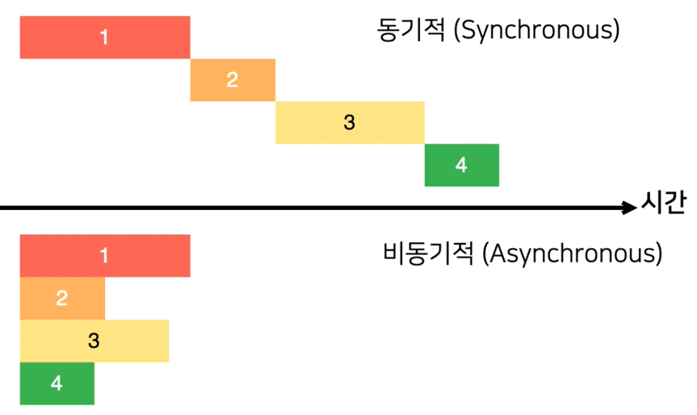

# 비동기 처리 이해

## 동기적 처리와 비동기적 차이의 차이



## 동기적 처리
`work()`실행 후 `다음 작업` 메시지가 출력됨
```js
function work() {
    const start = Date.now()
    for (let i =0; i < 1000000000; i++) {
        
    }
    const end = Date.now()
    console.log(end - start + 'ms')
}

work()  // 603ms
console.log('다음 작업') 
```

실행결과
```
614ms
다음 작업
```

## 비동기적 처리 - setTimeout을 활용
기존의 코드진행 흐름을 막지 않고 바로 실행

```js
'use strict'

function work() {

    setTimeout(() =>{
        const start = Date.now()
        for (let i =0; i < 1000000000; i++) {
        
        }
        const end = Date.now()
        console.log(end - start + 'ms')
    }, 0)  // 실제로는 0ms아닌 4ms 뒤에 실행됨 - 브라우저에서 지정한 최소값이 4ms이기 때문
}

work()  // 603ms
console.log('다음 작업') 
```

실행 결과
```
다음 작업
635ms
```

위의 코드를 응용
```js
'use strict'

function work(callback) {

    setTimeout(() =>{
        const start = Date.now()
        for (let i =0; i < 1000000000; i++) {
        
        }
        const end = Date.now()
        callback(end - start)
    }, 0) 
}

work((ms) => {
    console.log("작업 완료")
    console.log(ms + "ms")
})  // 603ms
console.log('다음 작업') 
```

## Promise - ES6에 도입된 비동기 작업을 조금 더 쉽게 처리할 수 있게 도와줌

Promise 사용전 callback 지옥 예제
```js
'use strict'

function increaseAndPrint(n, callback) {
    setTimeout(() => {
        const increased = n + 1
        console.log(increased)
        if (callback) {
            callback(increased)
        }
    }, 1000)
}


increaseAndPrint(0) // 1 출력

// 위의 코드를 이용하여 1, 2, 3, 4, 5까지 출력
increaseAndPrint(0, (increased) => {
    increaseAndPrint(increased, (increased) => {
        increaseAndPrint(increased, (increased) => {
            increaseAndPrint(increased, (increased) => {
                increaseAndPrint(increased, (increased) => {
                    console.log("작업 끝")
                })
            })
        })
    })
})
```

Promise 사용예
```js
/**
 * 성공은 resolve를 호출
 * 실패는 reject를 호출
 */
const myPromise = new Promise((resolve, reject) => {
    setTimeout(() => {
        resolve('result') // 성공하면 then 함수의 파라미터로 'result'값을 넘김
    }, 1000)
})

myPromise.then((successData) => {
    console.log(successData) // result 출력
})

// reject는 Error 객체를 넘긴다
const errPromise = new Promise((resolve, reject) => {
    setTimeout(() => {
        reject(new Error("Failed!!!"))
    }, 1000)
})

// catch 함수의 파라미터에 reject에서 넘긴 Error 객체가 담겨있음
errPromise.catch((err) => {
    console.log(err.message + "~") // Failed!!! 출력
})
```

위의 callbak 지옥을 Promise로 풀어낸 코드는 다음과 같다.
```js
'use strict'

const increaseAndPrint = (n) => {
    return new Promise((resolve, reject) => {
        setTimeout(() => {
            const value = n + 1
            if (n < 5) {
                console.log(n)
                resolve(value)
            } else {
                const error = new Error()
                error.name = 'Number is greate equal to 5'
                reject(error)
            }
        }, 1000)
    })
}

// Promise를 체이닝 하려면 함수에서 Promise 객체를 반환해야한다
increaseAndPrint(0)
    .then(increaseAndPrint)
    .then(increaseAndPrint)
    .then(increaseAndPrint)
    .then(increaseAndPrint)
    .then(increaseAndPrint)
    .then(increaseAndPrint)
    .catch((err) => console.error(err))
```

## async, await 사용하기 - ES8 부터 도임

async, await는 Promise를 더욱더 쉽게 사용해주는 문법이다.

```js
'use strict'

const sleep = (ms) => {
    return new Promise(resolve => setTimeout(resolve, ms))
}

/**
 * async를 사용하는 함수는 함수 앞부분에 async 키워드를 붙인다.
 */
async function process() {
    console.log("안녕하세요")
    await sleep(1000); // Promise를 반환하는 함수 앞에 await키워드를 붙인다. await를 붙이면 Promise를 기다린다
    console.log('반갑습니다!')
    return true
}
/**
 * 출력
 * 안녕하세요
 * 반갑습니다!
 */
process()

/**
 * async 키워드가 붙은 함수는 Promise를 암시적으로 반환한다
 */
process()
    .then(value => console.log(value)) // true 출력
```

에러 발생을 시키고 싶다면 다음과 같이 한다.  
이렇게 함으로써 try..catch문을 이용한 에러처리가 가능해진다.  

```js
'use strict'

const sleep = (ms) => {
    return new Promise(resolve => setTimeout(resolve, ms))
}

async function error() {
    await sleep(1000)
    const error = new Error()
    error.name = "Time out!!!"
    throw error
}

async function process() {
    try {
        await error();
    } catch (e) {
        console.log(e)
    }
}

process()
```

## Promise.all, Promise.race의 활용 - 여러개의 Promise 한번에 처리

다음과 같이 각각 처리하면 await 키워드를 여러번 사용하게 된다.
```js
'use strict'

const sleep = (ms) => {
    return new Promise(resolve => setTimeout(resolve, ms))
}

const getDog = async () => {
    await sleep(1000)
    return '멍멍이'
}

const getRabbit = async () => {
    await sleep(500)
    return '토끼'
}

const getTurtle = async () => {
    await sleep(3000)
    return '거북이'
}

async function process() {
    const dog = await getDog()
    console.log(dog)

    const rabbit = await getRabbit()
    console.log(rabbit)

    const turtle = await getTurtle()
    console.log(turtle)
}

/**
 * 하나씩 처리되고 있음 출력 결과
 * 멍멍이
 * 토끼
 * 거북이
 */
process()
```

`Promise.all([Promise 배열])` 을 사용하면 모든 Promise가 처리된 후에 결과 값을 배열로 반환하게 된다.
```js
'use strict'

const sleep = (ms) => {
    return new Promise(resolve => setTimeout(resolve, ms))
}

const getDog = async () => {
    await sleep(1000)
    return '멍멍이'
}

const getRabbit = async () => {
    await sleep(500)
    return '토끼'
}

const getTurtle = async () => {
    await sleep(3000)
    return '거북이'
}

async function process() {
    const results = await Promise.all([getDog(), getRabbit(), getTurtle()])
    console.log(results)
}

process() // [ '멍멍이', '토끼', '거북이' ]
```

비구조화 할당으로 다음과 같이 깔끔하게 처리할 수도 있다

```js
async function process() {
    const [dog, rabbit, turtle] = await Promise.all([getDog(), getRabbit(), getTurtle()])
    console.log(dog)
    console.log(rabbit)
    console.log(turtle)
}

process()
```

`Promise.race([Promise 배열])`는 Promise 배열 중에서 가장 빨리 끝난 Promise 하나만 반환한다.
```js
'use strict'

const sleep = (ms) => {
    return new Promise(resolve => setTimeout(resolve, ms))
}

const getDog = async () => {
    await sleep(1000)
    return '멍멍이'
}

const getRabbit = async () => {
    await sleep(500)
    return '토끼'
}

const getTurtle = async () => {
    await sleep(3000)
    return '거북이'
}

async function process() {
    const result = await Promise.race([getDog(), getRabbit(), getTurtle()])
    console.log(result)  // 토끼
}

process()
```

